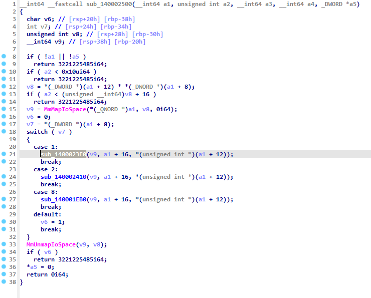
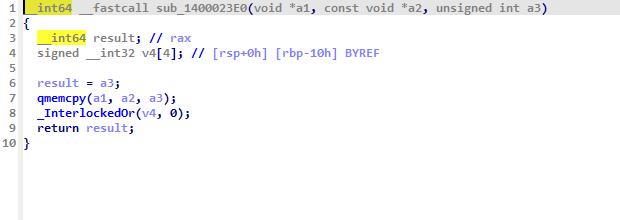

# DirectPhysMapper

## Context

- Vulnerable Driver exposes `MmMapIoSpace`, BUT It does NOT return the **base virtual address that maps the base physical address for the range** , like the original `Physmeme` project assumes in its framework. Instead , it reads and writes directly to the physical memory from inside the driver . The modifications below are done accordingly.
- **NB**: Specifics of the vulnerable driver have been redacted as it is still undisclosed.

## Biggest modifications

- Adding **Superfetch technique** KVA to Physical memory address translation.
- `kernel_ctx` constructor takes in the physical address as parameter and removes full physical memory scan , in this drivers case , causes BSOD. 
- In `util/hook.hpp` , **original bytes save + Install of Hook + Uninstall of Hook** adapted for direct physical reads / writes.  

## Custom driver to map

- Per `Physmeme` instrunction , `DriverEntry` should be modified to a custom driver entry with a specific signature.
- Enable `CET Shadow Stack compatibility` in the linker settings.  

## Vulnerable Write Function

### References

- https://git.back.engineering/IDontCode/physmeme
- https://www.outflank.nl/blog/2023/12/14/mapping-virtual-to-physical-adresses-using-superfetch/
- https://github.com/jonomango/superfetch
- https://learn.microsoft.com/en-us/cpp/build/reference/cetcompat?view=msvc-170
